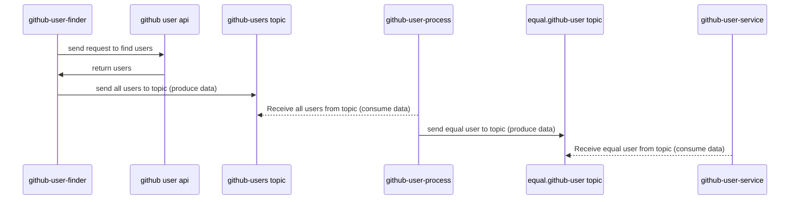

# Spring Kafka Streams implemented with Kotlin❤️

## How to setup

- Run docker compose with the following command in the project's root path
  >  docker-compose up -d
- Create topics
  >  Create two topics in the http://localhost:9021/clusters with the names **github-users** and **equal.github-user**
- Run the spring projects in the following order
  >  github-user-finder { Producer }
  >  github-user-process { Consumer and Producer }
  > github-user-service { Consumer }
- To test the project request to this url
  >  http://localhost:8080/users/find/asharafkar

## How to works

The sequence diagram shows the flow of data (from Produce to Consume)

